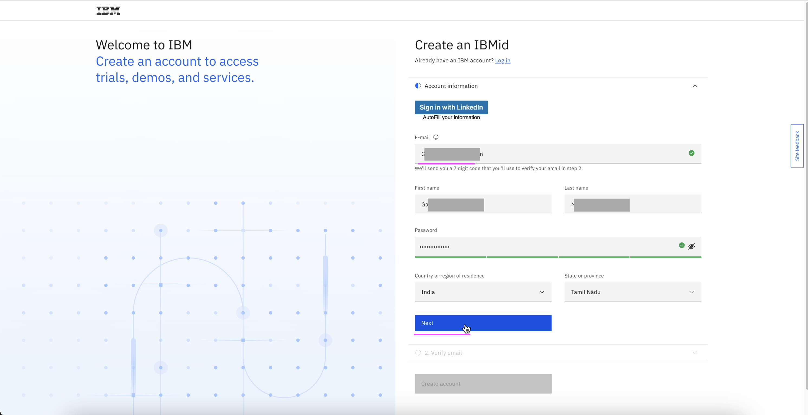
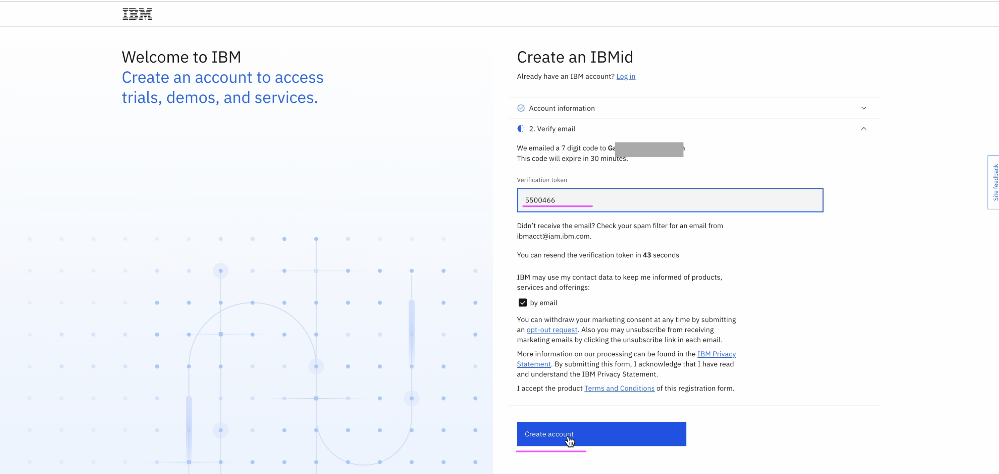
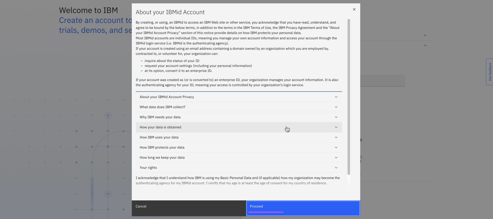
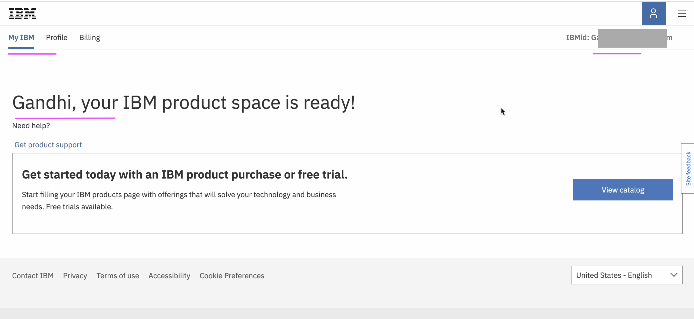

# Create IBMid

Let’s create a new IBMid.

- Open this link https://www.ibm.com/account/us-en/signup/register.html to get a form to create IBMid.
- Enter the values `Email Id, First Name, Last Name, Password` and etc
- Click on `Next` button.

- Enter the verification token that you received on your mail. 
- Click on `Create Account`

- Click on `Proceed`. 

Your IBMid is successfully created. 

