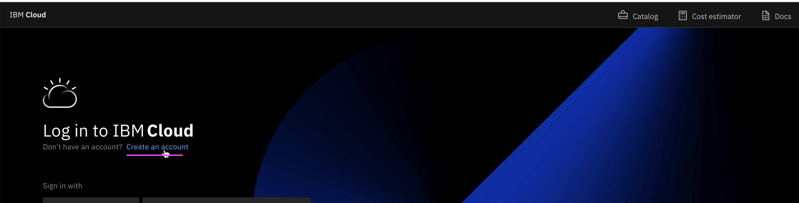
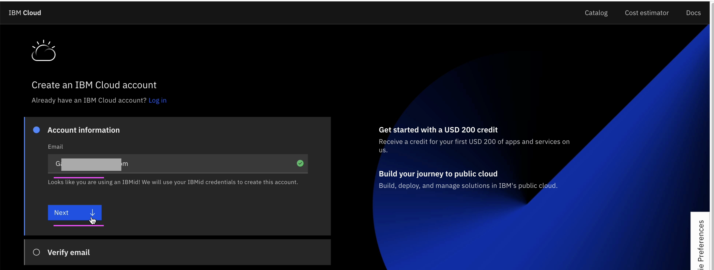
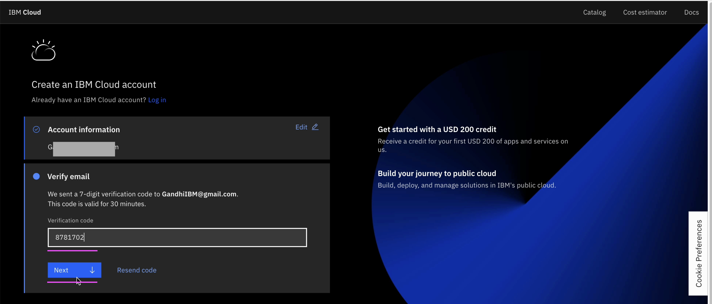
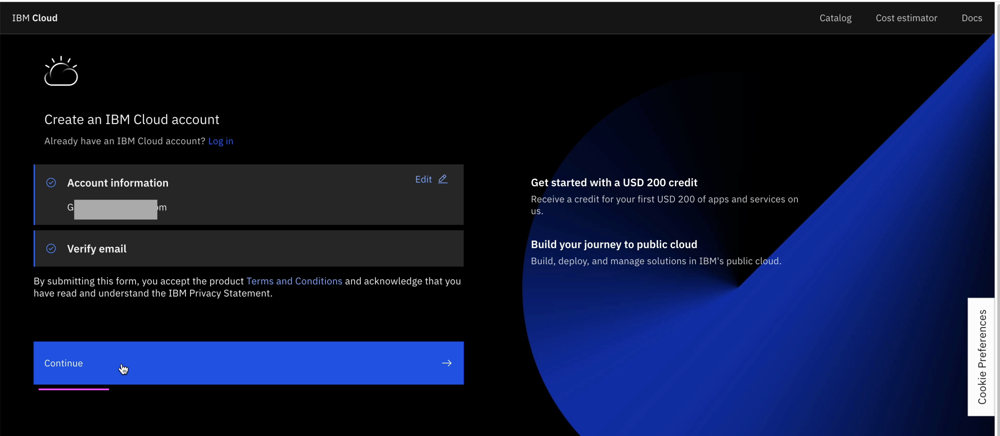
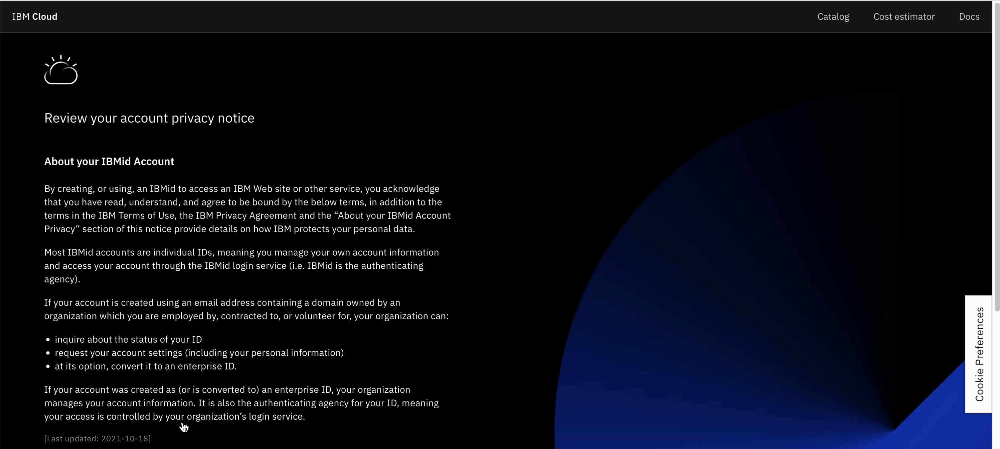
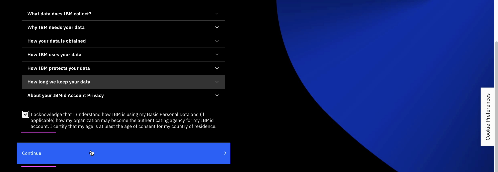
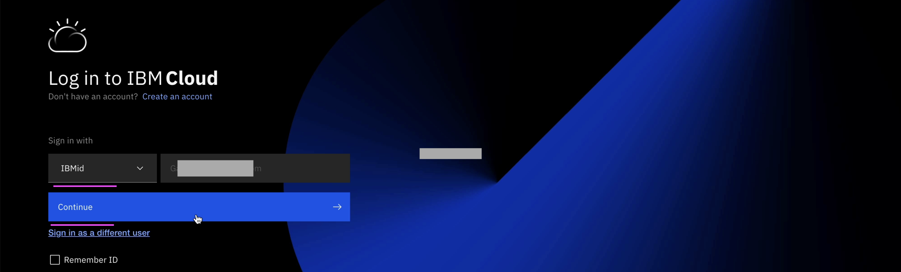
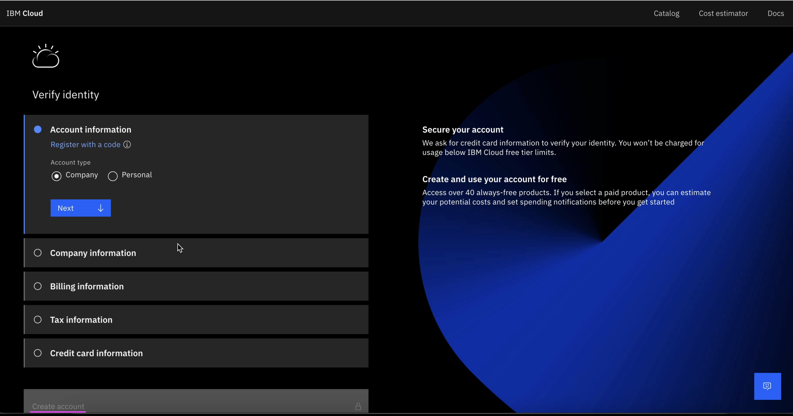

# Create IBM Cloud Account

Let’s create new IBM Cloud Account.

- Open this link https://cloud.ibm.com.
- Click on `Create an Account` link.

- Enter your IBM Id.
- Click on `Next`.

- Click on `Continue`. 

- Check the `I Acknowledge` check box.
- Click on `Continue`.

- Click on `Continue`.

- Enter all the required official / personal info including credit card info.
- Click on `Create Account`.

Your account will get created.

