# Sign up for watsonx.ai via TechZone

Let’s us look at how Partners can create watsonx.ai account via Techzone.

Partners should have registered their Email-Id/IBMid in Partner Plus. 

## Create Reservation

- Access the URL https://techzone.ibm.com/collection/tech-zone-certified-base-images/journey-watsonx
- Click on `Reserve` button in the `watsonx.ai SaaS` tile.

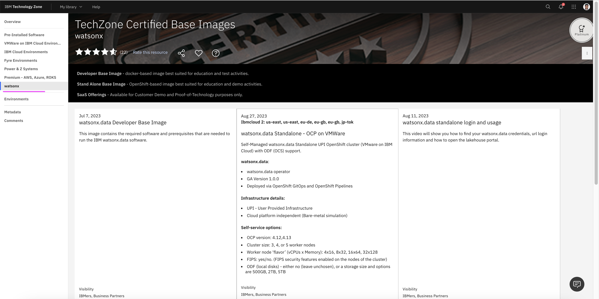
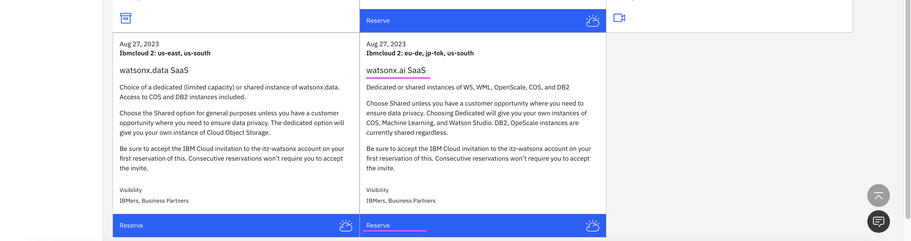

- Click on `Reserve Now` option 
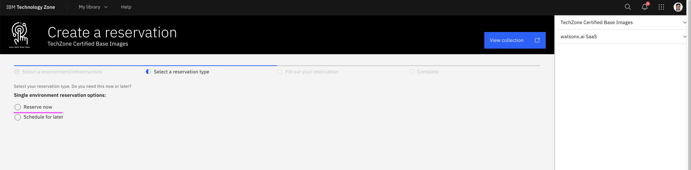

- Enter the details Purpose, Purpose Description and Preferred Geography.
- Check on `I Agree`.
- Click on `Submit`.
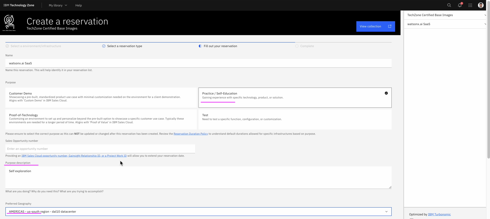
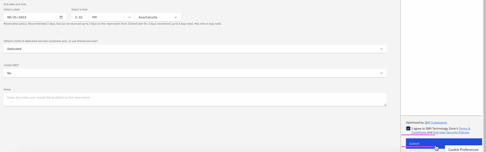

## Join Cloud Account

IBM Cloud should have sent an Action required mail in your mailbox now. 
- Click on `Join now` link in the mail received from Techzone.
- Note down the `Account ID` (itz-watsonx) 
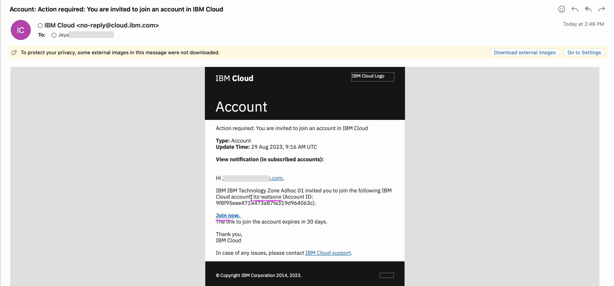

- Verify the account details.
- Enable the checkbox `I Accept`.
- Click on `Join Account`
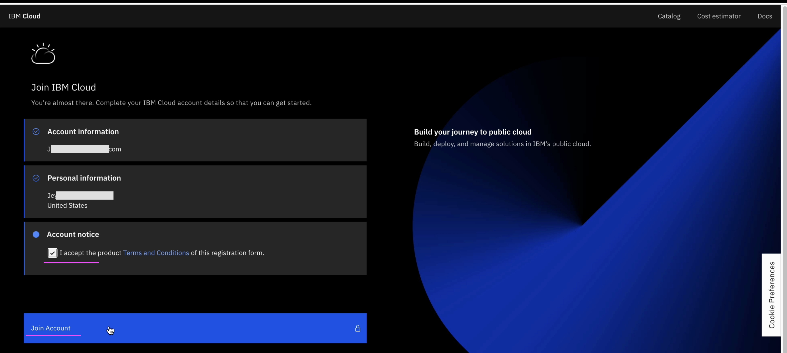

- Verify the account id in the top right.
- Click on `expand` icon on the left side menu.
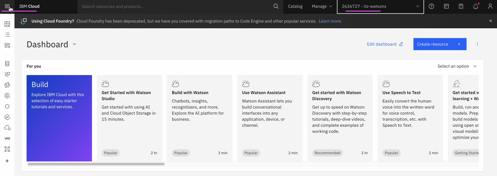

- Click on `watsonx` menu on the left side menu.
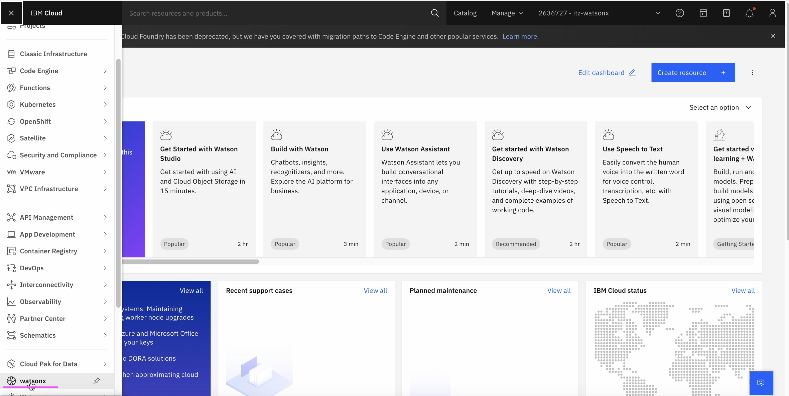

- Click on `Getting Started on Watsonx.ai title` menu. 
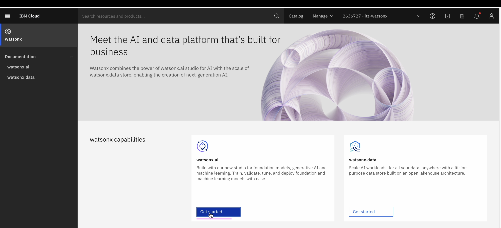

- Choose the `Dallas` region.
- Click on `Log In`.
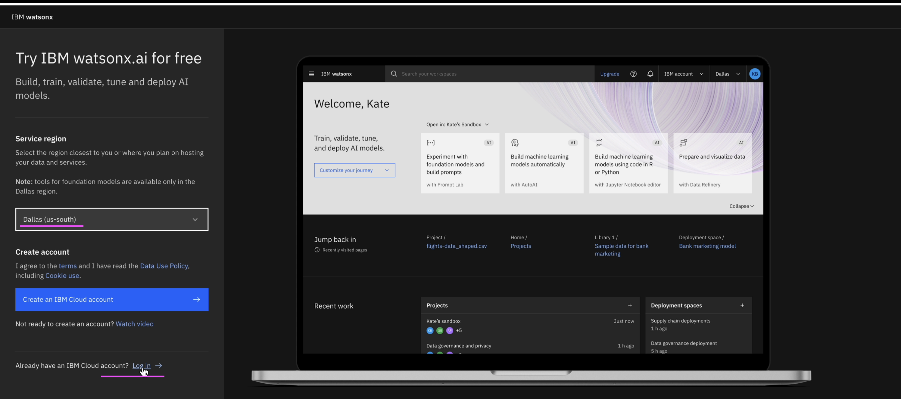

Watsonx.ai home page is displayed.
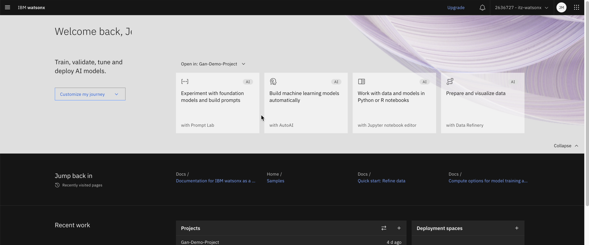

## Extending Techzone access
By default, the Techzone access is given for 2 days. You can extend it twice for another 4 days. 

- Go to `My Reservations` page in the Techzone https://techzone.ibm.com/my/reservations
- In the `Watsonx.ai SaaS` tile choose the `Extend` menu.
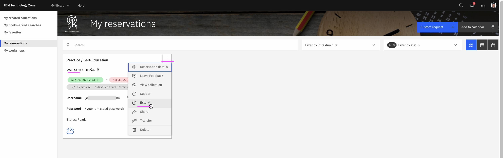

You can extend this reservation for further 2 days.
- Choose the Date
- Click on the `Extend`
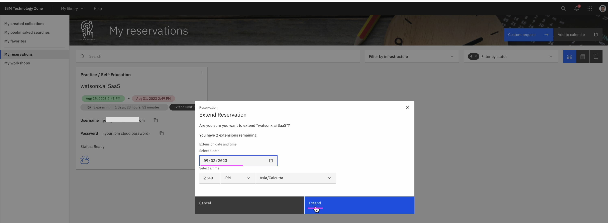

Now the reservation is extended for 2 days. You can do one more extension as the Extend Limit is 1 below.
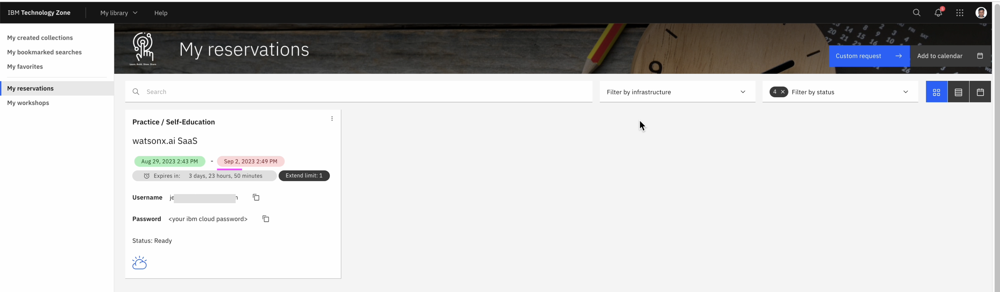

