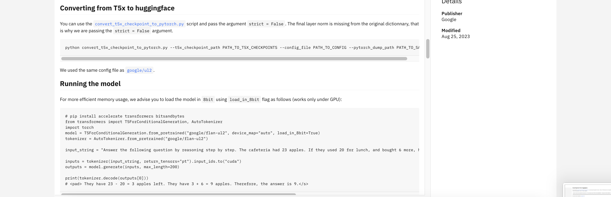

# watsonx.ai Quick Tour - Samples

watsonx.ai bundled with samples for Data, Foundation Model, Notebook, Project, and Prompt.
Let’s us explore about what is available in Samples.

- Click on the `Samples` from left menu.

 
You can view all the samples available.

- Click on the Filter icon in left menu.

## 1. Foundation Model

Let us look at the Foundation model samples.

- Click on the `Foundation Model` Checkbox icon in the left menu. It shows various foundation models.
- Select the `flan-u12-20b` tile.

See the various details about the foundation model.

## 2 Notebook

A notebook is a web-based environment that can be used to run small pieces of code that process your data, and you can immediately view the results. There are several notebook samples available to try different code pieces that interacts with watsonx.ai.

Let us explore `Notebook` samples available in watsonx.ai.

- Click on the `Notebook` Checkbox icon in the left menu. 
It shows various notebooks available. Notebook contains both the documentation and coding to solve some problem. 
- Select the `Use Watsonx to analyse car rentals reviews` tile.

See the details about the selected Notebook.

## 3 Project

- Click on the `Project` Checkbox icon in the left menu. It shows the various projects. 
- Select a project tile.

See the details of the project.

## 4 Prompts

Let’s look at the Prompt samples.

- Click on the `Prompt` Checkbox icon in the left menu.
You can see 9 results showing up. It contains the various Prompts. 

- Select an `Earnings Call Summary` tile.

See the details of the prompt.

