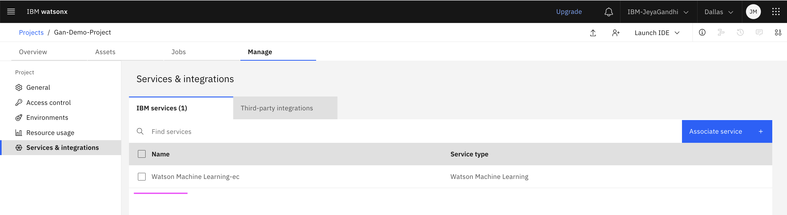

# watsonx.ai Quick Tour - Projects

A project is a collaborative workspace where you work with data and other assets to accomplish a particular goal.

By default, a project with name sandbox is created automatically when you sign up for watsonx.ai.

A project can include resources such as Collaborators, Data assets, Tools, Environments, Jobs, Asset storage and Integrations.

## 1. New Project  

Let’s create a new Project.

Click on the `<Projects > View All Projects>` link from the left side menu.

- Click on New Project.

- Click on Create an Empty project tile.  

- Enter a Name for the Project.
- Click on Create.

- The Project got created.

## 2. Associate WML instance

For some types of assets, you must associate the IBM Watson Machine Learning service with the project. You are prompted to associate the IBM Watson Machine Learning the first time you open tools like Prompt Lab, AutoAI and etc.

Let’s add Watson Machine Learning service to a project directly.
- Go to Manage > Services & Integrations > IBM Services section.
- Click on `Associate Service`

- Select your IBM Watson Machine Learning service instance.
- Click on `Associate`. 

The IBM Watson Machine Learning service instance is associated with the Project now

## 3. Collaborate with other users

Collaborators are the people you add to the project to work together. After you create a project, add collaborators to share knowledge and resources freely, shift workloads flexibly, and help one another complete jobs.

You can add members of your IBM Cloud account as collaborators.

In the `Access Control` section of the project, you have option to add `Collaborators`.

## 4. Explore Project

Let’s explore what are the different info available in the project.

### Overview

The Overview tab shows the Project  Dashboard. It contains the following sections.
- Jump back in (Quick access links to various assets you have visited recently)
- Resource Usage
- Project History
- Readme documentations 

### Assets

Assets tab shows various assets associated with this project. The various assets are
- Data assets (from files, connected data assets, or imported data assets)
- Notebooks
- Saved Prompts
- Flows
You can add other types of assets by clicking `New task` or `Import assets`.
You can manage assets in a project by adding them, editing them, or deleting them.

### Manage

Assets tab shows various assets associated with this project. The assets are:
- Data assets (from files, connected data assets, or imported data assets)
- Notebooks
- Saved Prompts
- Flows

In the `General` section, you can see the `Project Id` and `Storage` related info.

In the `Access Control` section, you can see the `Collaborator` and `Access token` related info.

In the Environments section, you can see the `Runtimes` and `Runtimes Templates`
related info. 

You can choose a `Runtimes` and start/stop them.

In the `Resource usage` section, you can see the `Resource usage summary` related info.

In the `Services & Integrations` section, you can see the `WML` instance already associated.
