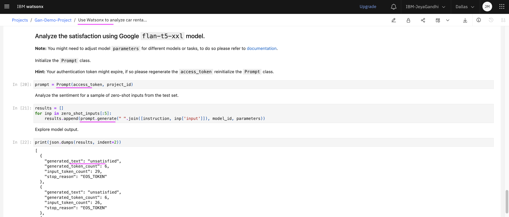
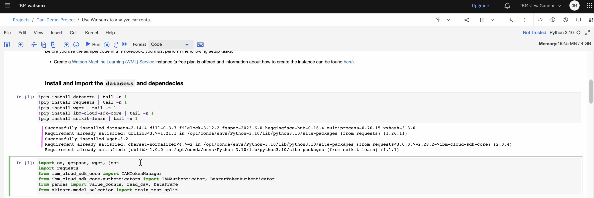

# watsonx.ai Quick Tour - Notebook

A notebook is a web-based environment for interactive computing. You can use notebooks to run small pieces of code that process your data, and you can immediately view the results of your computation. 

 A user created notebook can be shared with other users.

## 1. Import Notebook into Project

Let’s look at how to import a notebook from Sample and add it to an existing project.

- Choose a notebook from Sample.

- Click on `Add to Project`.
- Choose the project.
- Click on `Add`. 

Runtime is required to execute the notebook. To execute a python notebook, you need to choose a python runtime.

- Choose the Runtime. 
- Click on `Create` button.

Notebook is imported into the Project. See the Notebook details.

## 2. Access Models from Notebook

Once the notebook is imported into Project, it can be executed.
The code written in the notebook could interact with the foundation models of watsonx.ai.

Let’s look at how to execute the runbook.

- Select the first snippet from the notebook.
- Select `Run` button in the top menu.

The code snippet executed successfully.

- Select the next code piece. 

- Click on the `Run` again. And continue like this until you complete executing the all the snippets in the notebook.

Click on the `<Projects > View All Projects>` link from the left side menu.