# watsonx.ai Quick Tour - Prompt Lab

In the Prompt Lab in IBM watsonx.ai, you can experiment with prompting different foundation models, explore sample prompts, as well as save and share your best prompts.

- Click on the `Prompt Lab` tile to Open the Prompt lab.
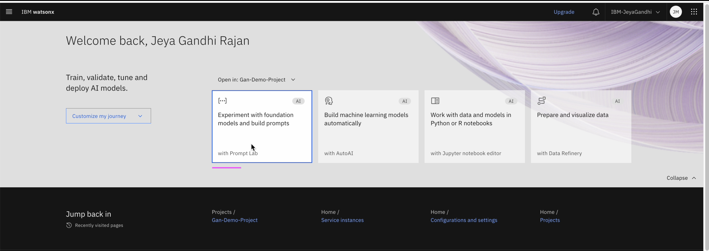

It opens the Prompt Editor of the Prompt Lab.

## 1. Prompt editor

You can see the various section available in the Prompt Editor

**Instruction**: An instruction is an imperative statement, such as `Summarize the following article` that we inform LLM

**Examples**:  You can specify one or more pairs of examples input and the corresponding desired output.

**Test input**:  You can enter the final input of your prompt.

**Generate Button**: When you click on Generate button the text from the fields is sent to the model in a template format.
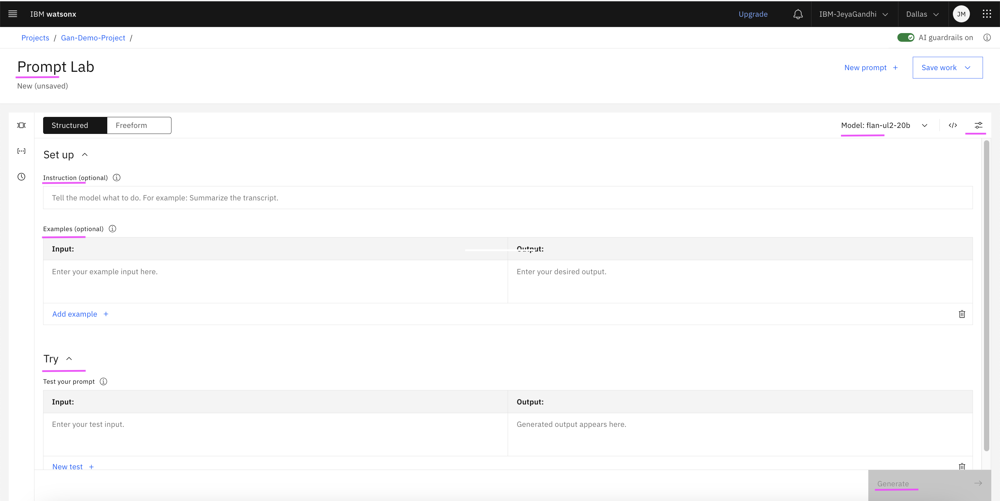

**Model**: The selected model is flan-u12-20b. You can select other models by clicking on View all Foundation models.
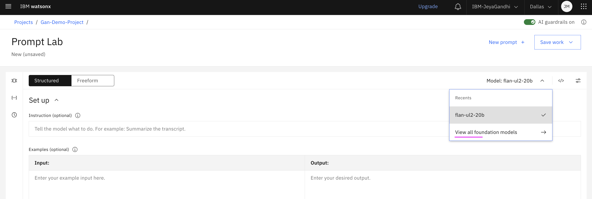

You can choose any of the models from the list.

**Model Parameters**: Model parameters helps to set different parameters for the LLM.
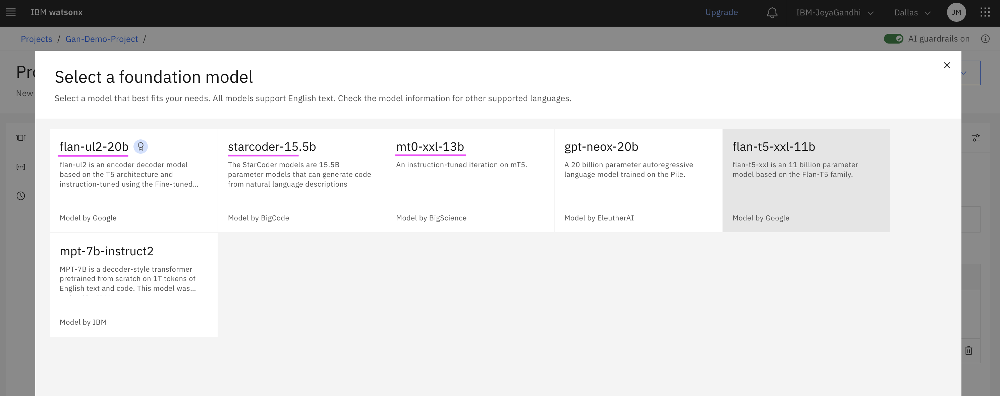

- Click on the Right end icon to open the `Model Parameters` section.
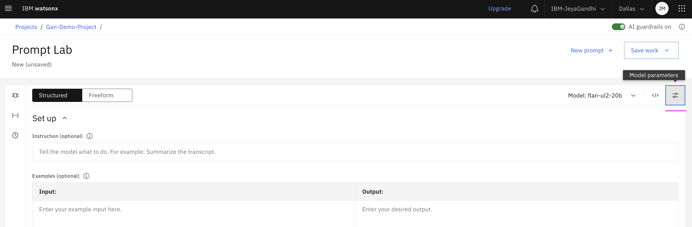

It shows the parameters for the `Greedy` method.
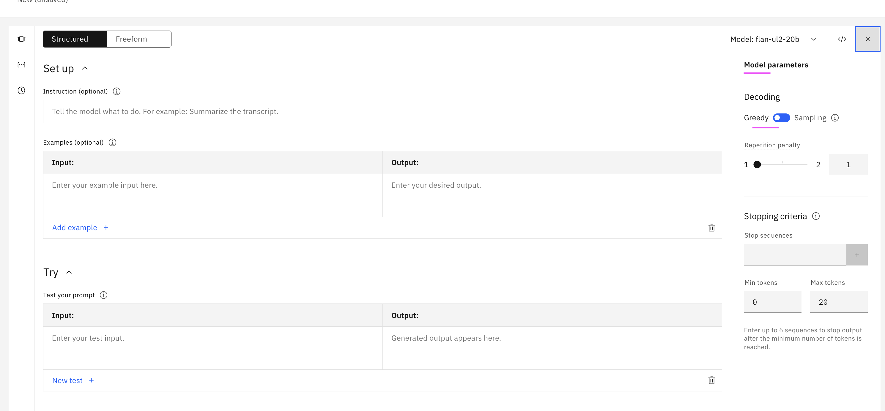

It shows the parameters for the `Sampling` method.
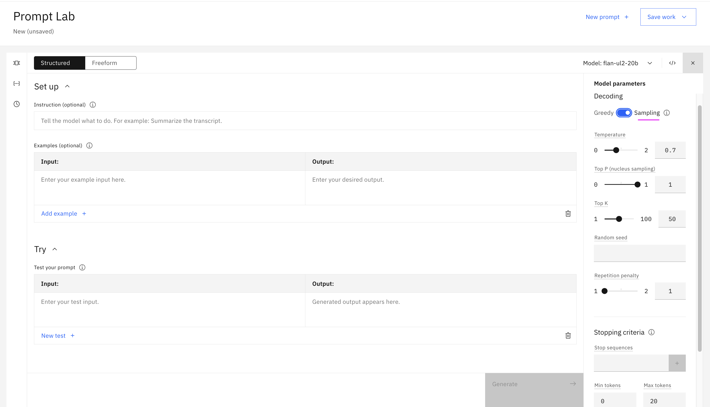

## 2. Sample Prompt

Let us explore about Prompt Lab with the help of a sample prompt.

There are several samples prompt available in the Prompt Lab.
- Meeting transcript Summary 
- Earnings Call Summary
- Scenario Classifications
- Sentiment-classification
- Prompt – Email
- Prompt – Thanks
- Entity Extraction
- Fact Extraction
- Question

Let’s consider `Meeting transcript Summary` for detailing here.

- Click on the `Sample Prompts` icon.
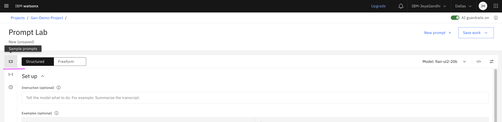

- Select the `Meeting transcript Summary` link from Sample prompts section.
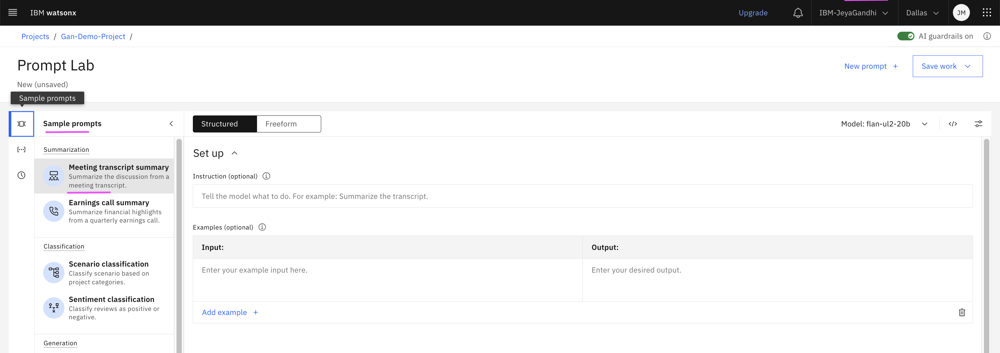

- Observe the content of the text boxes `Instruction, Examples and Try`.
- Click on the `Generate` button.
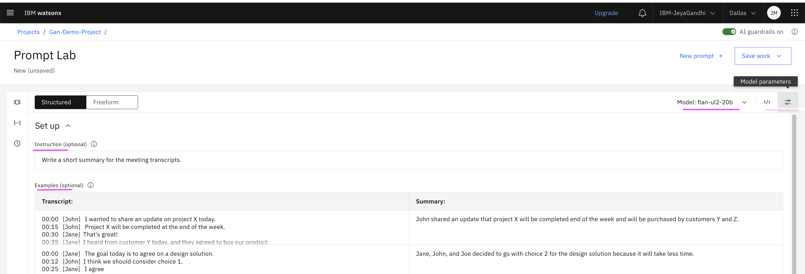
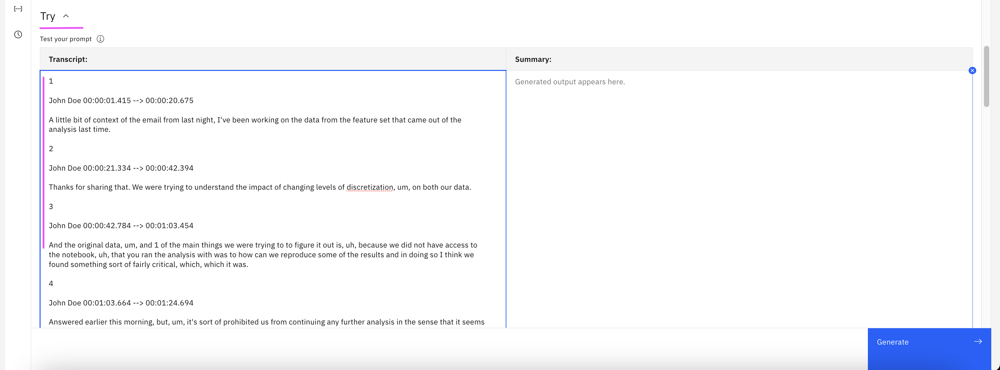

See the generated Watsonx LLM generated response in `summary`.
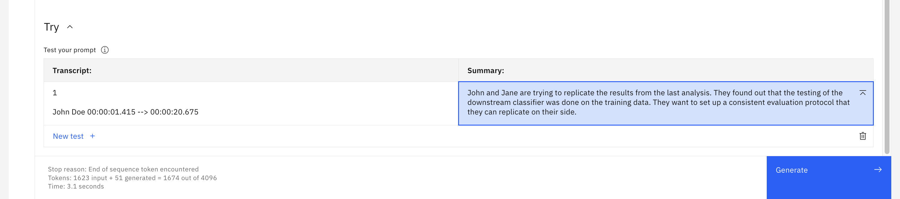

## 3. View Code

You can also view the code for the prompt that you made in the Prompt Lab. 

- Click on `View Code` icon.
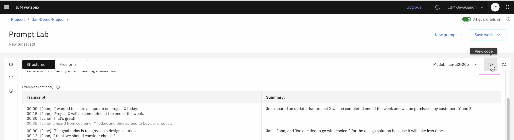

You can see the entire content of the prompt as curl script, which is ready to call watsonx.ai LLM.

- Click on `Expand` icon.
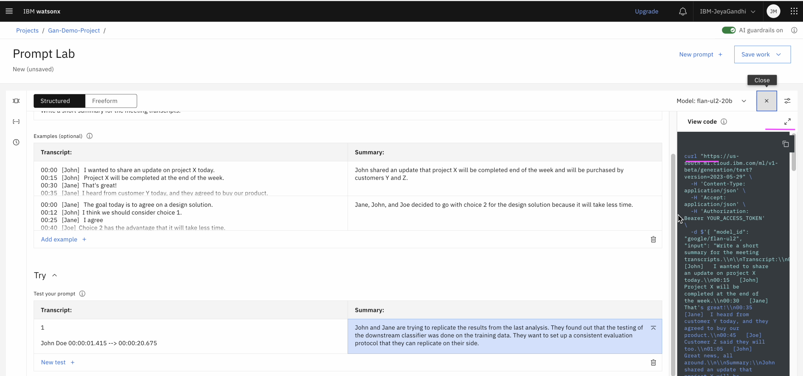

You can view the curl script in a full window mode.
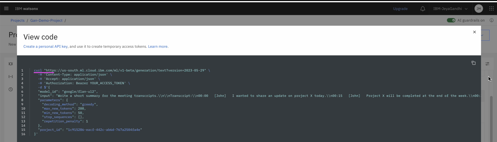

## 4. Save Prompt
The prompt that we have modified can be saved as a new Prompt. So that it can be referred later to share with other collaborators.

- Click on `Save Work > Saves As` menu.
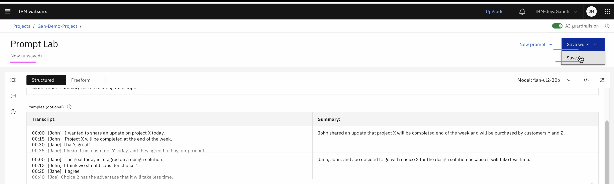

- Choose Prompt as `Asset Type`
- Enter `Name` of the Prompt
- Save it.
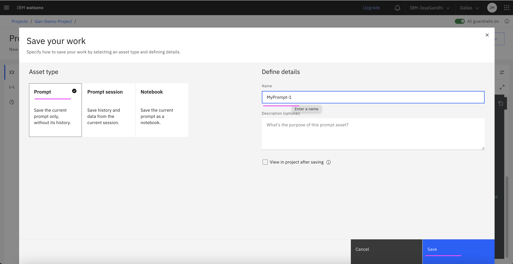

Now the Prompt is saved as `MyPrompt-1`
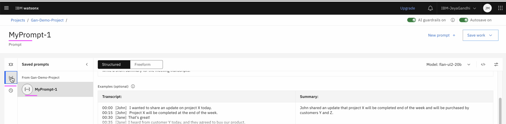

