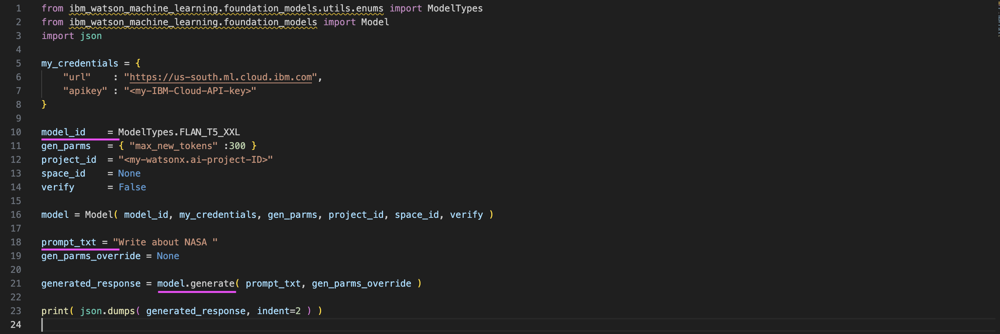
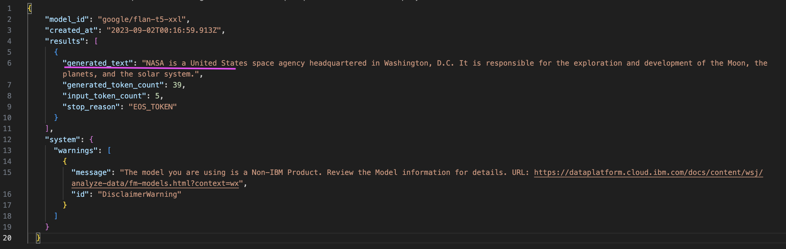
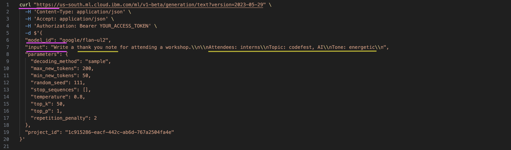
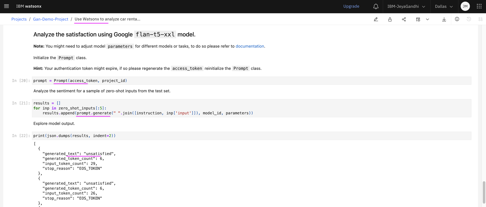

# 4 Programmatically inferencing from Foundation Models

You can prompt foundation models in IBM watsonx.ai programmatically using the Python library.

## 4.1 Python 

Here is the sample python code that prompts the foundation model in IBM watsonx.ai. It prompting to `Write about NASA`.

The actual code is available here [here](./files/03-prompt-a-model.py)



You need to replace `<my-IBM-Cloud-API-key>` and `<my-watsonx.ai-project-ID>` with your API key and project ID.

The generated text from the watsxonx.ai generate AI is the below. It has written some text about NASA.



Here are some useful links.

Foundation models Python library
https://ibm.github.io/watson-machine-learning-sdk/foundation_models.html

Python samples
https://dataplatform.cloud.ibm.com/docs/content/wsj/analyze-data/fm-python-lib.html?context=wx&audience=wdp


## 4.2 Curl 

Here is the sample curl script that prompts the foundation model in IBM watsonx.ai. It prompting to `Write a thank you note`.

The actual code is available here [here](./files/04-prompt-by-curl.sh)



You need to replace `YOUR_ACCESS_TOKEN` with your IAM access token.

The generated text from the watsxonx.ai generate AI is the below.

```
We are thrilled that you could make it to our workshop and hope that you had a great time. There were lots of amazing interns at this year's codefest and we think you represent the best of them. Thank you for all of your hard work and continued efforts! Please let me know if I can be of further support. Much appreciated,
```

## 4.3 Notebook

You have already seen that from Notebook also we can prompt the watsonx.ai using the python script.


